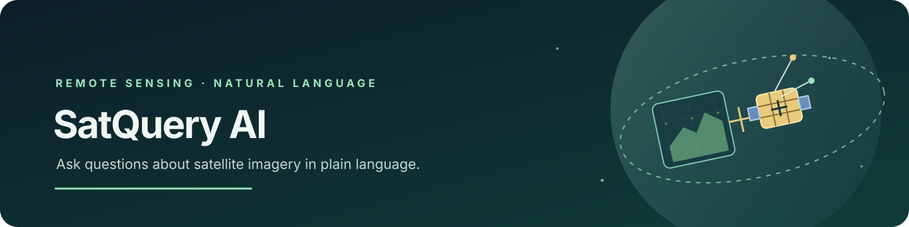
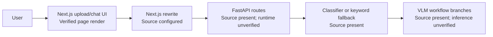

<p align="center">
  
  <br />
  <strong>SatQuery AI</strong><br />
  <em>Turn satellite imagery into answers people can act on.</em><br /><br />
  <a href="https://img.shields.io/badge/SIH-2026-1f6feb"></a>
  <a href="https://img.shields.io/badge/PS-SIH26167-315c7d"></a>
  <a href="https://img.shields.io/badge/theme-Space%20Technology-493ca6"></a>
  <a href="https://img.shields.io/badge/category-Software-317c6e"></a>
  <br /><br />
  <a href="https://youtu.be/_3UY2hBNBjk">🎥 Deck demo video</a> ·
  <a href="docs/SatQuery_Seal_Team6.pdf">📊 SIH deck</a> ·
  <a href="https://github.com/dhwanijain-dev/anonymous_codebase_167">GitHub repository</a>
</p>

SatQuery’s **final solution will let a user ask a question in plain language and receive a task-specific interpretation of satellite imagery, with visual evidence and an auditable analysis trail.** The prototype is the first proof point; the roadmap takes it to a validated pilot and then to scale.

## Final solution at a glance

- Ask a natural-language question about one image or a compatible optical/SAR or time-separated pair.
- Route the request to a remote-sensing workflow for visual question answering, captioning and grounding, change analysis, or optical–SAR analysis.
- Return an answer with relevant visual evidence and a trace of the selected tasks and models; calibrated answer confidence is a target milestone.
- Process large geospatial rasters through planned pair checks, bounded tiling, and caching.
- Validate on public remote-sensing benchmarks, then pursue operational evaluation with data partners where available.

## Today vs Final — prototype traceability matrix

Status describes a capability demonstrated in this repository snapshot. Source paths are identified separately when their runtime has not been verified.

| Capability | Today: prototype | Final solution |
| --- | --- | --- |
| Browser experience | ✅ **Live in prototype** — production UI build and HTTP page response verified in an isolated copy. | Keep the upload-and-question flow as the analyst entry point. |
| Analysis API and specialist inference | 🎯 **Planned for final solution** — API and workflow code are present; a backend inference run was not verified. | Establish a reproducible model-backed pilot with a documented runtime. |
| Optical–SAR and bi-temporal analysis | 🎯 **Planned for final solution** — source has two-image workflow branches; pair compatibility checks are a Phase 2 deliverable. | Validate modality, time, and spatial alignment before specialist inference. |
| Evidence, confidence, and audit | 🎯 **Planned for final solution** — response-trace and optional grounding paths are in source; no calibrated answer-confidence field is returned. | Attach task evidence, calibrated confidence, and an auditable result record. |
| Large-area and multi-user operation | 🎯 **Planned for final solution** — deck proposes tile processing, caching, PostgreSQL, and VectorDB. | Add bounded raster processing and a deployment path designed for measured workloads. |

**Status key:** ✅ Live in prototype · 🚧 In active development · 🎯 Planned for final solution. The runtime-verified scope in this snapshot is the browser shell; the roadmap advances model-backed capabilities through the pilot.

## Evaluator Quick View

The fastest verified demo is the web interface. These commands passed on an isolated copy of `frontend/`; they do not start the model API.

```powershell
cd frontend
pnpm install --frozen-lockfile
pnpm build
pnpm start -- --port 3100
```

Open `http://localhost:3100` to show the SatQuery upload/chat UI. For the implementation map, see [Prototype architecture (today)](#prototype-architecture-today); for the build path, see [From prototype to production](#from-prototype-to-production). Backend inference was not run, so use the target view for the proposed end-to-end experience.

| SIH deck area | README location |
| --- | --- |
| Proposed solution | [Solution and innovation](#solution-and-innovation) |
| Technical approach | [Target architecture](#target-architecture), [Tech stack](#tech-stack), [AI and ML](#ai-and-ml) |
| Feasibility and viability | [Why this will work](#why-this-will-work), [Risks and mitigation strategy](#risks-and-mitigation-strategy), [Roadmap](#from-prototype-to-production) |
| Impact and benefits | [Projected impact](#projected-impact) |
| Research and references | [References](#references-acknowledgements-and-licence) |

## Problem

Satellite imagery can show crop conditions, damage, land-cover change, and urban growth. Turning those pixels into a useful answer often requires specialist tools and remote-sensing expertise. SatQuery’s proposal is a conversational entry point to task-specific vision models, with evidence and a clear path to validate the results.

| SIH field | Deck value |
| --- | --- |
| Edition / problem statement | 2026 / SIH26167 |
| Title | SatQuery AI |
| Theme / category | Space Technology / Software |
| Team | Seal Team 6_SUAS26 / Team ID 178961 |
| PS-owning organisation | TODO(identify from the official SIH problem statement) |
| Official PS text / portal link | TODO(add the official SIH PS URL; the deck contains a short framing only) |

## Solution and innovation

The proposal combines natural-language task routing with remote-sensing vision models. It focuses on three ideas:

1. **Route by the question and imagery.** The repository contains a multi-label query/image classifier and a deterministic keyword fallback. Its task-selection quality has not been benchmarked; Phase 2 will evaluate and tune it.
2. **Bring specialist workflows behind one question interface.** The deck proposes VQA, captioning/grounding, bi-temporal change analysis, and optical–SAR fusion. Corresponding workflow branches and model configuration are present in source; backend execution remains a Phase 2 verification step.
3. **Make results reviewable.** The API response construction includes task outputs and an execution trace, and the grounding path can return boxes/evidence. The final system will add a defined evidence contract and calibrated confidence so an analyst can inspect why an answer was produced.

These are design differentiators from the SIH deck, not measured superiority claims over other systems. The current routing code does not make a Groq or other external LLM supervisor request.

## Target architecture

**Target design.** Solid green nodes identify components represented in the prototype source; dashed gray nodes are planned. A solid node records code presence, not a verified backend runtime. Queueing, object storage, and stateless worker separation are **Proposed** deployment decisions for team review.

```mermaid
flowchart LR
  user[Analyst] --> ui[Browser upload and chat UI]
  ui --> proxy[Next.js API rewrite]
  proxy --> api[FastAPI analysis API]
  api --> decode[Image decode and normalization]
  decode --> pair[Proposed pair metadata and alignment checks]
  pair --> tiles[GeoTIFF tiling and cache]
  tiles --> route[Query and image router]
  route --> queue[Proposed job queue]
  queue --> workers[Proposed stateless GPU workers]
  workers --> qwen[Qwen2.5-VL and task adapters]
  workers --> sar[SARMAE and projector for optical–SAR]
  qwen --> compose[Task outputs and execution trace]
  sar --> compose
  compose --> confidence[Proposed evidence contract and confidence calibration]
  confidence --> result[Final analyst response]
  result --> store[Proposed object storage for imagery and results]
  result --> db[Proposed PostgreSQL metadata and VectorDB retrieval roles]
  result --> ui

  classDef prototype fill:#e4f7eb,stroke:#16803c,stroke-width:2px,color:#143d25;
  classDef planned fill:#f4f5f7,stroke:#7a8492,stroke-dasharray:5 5,color:#3f4650;
  class ui,proxy,api,decode,route,qwen,sar,compose prototype;
  class pair,tiles,queue,workers,confidence,result,store,db planned;
```



**Legend:** solid green = component represented in prototype source; dashed gray = target milestone. The arrows describe the proposed final request flow. Only the browser page render and frontend production build were verified at runtime.

### Target architecture narrative

The final system will accept a question with one image or a compatible pair, validate image and pair metadata, and split large rasters into bounded windows. The router will select the relevant task; GPU workers will run the configured Qwen2.5-VL adapters and SARMAE path. The response will pair the answer with task outputs, visual evidence, confidence methodology, and an audit trace. **Proposed:** define the evidence contract and calibration procedure before pilot evaluation. Evaluation will use named public benchmarks and, subject to access, operational data partners identified by the deck.

The deck names PostgreSQL and a VectorDB. **Proposed:** deploy a job queue and stateless GPU worker pool, store large inputs/results in object storage, and keep structured run metadata in PostgreSQL with the vector service for retrieval. This boundary would let the web/API tier scale separately from GPU inference; tile caching would reduce repeated raster work. The team should validate these choices against privacy, GPU cost, and pilot load before implementation.

### Prototype architecture (today)

**Prototype (today).** The browser UI is the runtime-verified portion. The API and model path below reflects source wiring; no end-to-end request was run.



## Why this will work

| Technical bet | Prototype evidence or de-risking plan | Roadmap phase |
| --- | --- | --- |
| Analysts can start from a simple question-and-image flow. | The frontend typecheck/build passed and its production page returned HTTP 200 in an isolated copy. Demo the interface shell; Phase 2 will connect and exercise the model-backed API. | Phase 1 → 2 |
| One router can dispatch to specialist tasks. | `backend/clf_router.py` and `backend/satquery_classifier.py` contain classifier/fallback paths and a checkpoint. Training image references do not resolve in this checkout and routing metrics are absent; Phase 2 adds a reproducible benchmark. | Phase 2 |
| Specialist VQA and SAR workflows can share the interface. | `backend/vlm.py` and `backend/model_loader.py` contain workflow and model-loading paths. The mitigation is a pinned Python/CUDA setup, model-access check, and clean backend smoke run before the pilot. | Phase 2 |
| Paired and large-raster analysis can meet field needs. | The deck identifies data scarcity, alignment, speckle, and raster size as risks. Phase 2 validates pairs and data; Phase 3 adds bounded tiling/cache and measures memory and latency. | Phase 2 → 3 |

## Risks and mitigation strategy

| Risk | Impact | Mitigation | Phase |
| --- | --- | --- | --- |
| Scarce paired optical–SAR and bi-temporal data | Weak evidence for fusion and change workflows. | Build a documented benchmark split from named public sources; seek ISRO/SAC evaluation access as proposed in the deck. | Phase 2 |
| Domain gap and unmeasured model quality | Answers may be unreliable for operational imagery. | Publish benchmark methodology, task-level metrics, and failure cases before a pilot; set acceptance thresholds before measurement. | Phase 2 |
| SAR speckle and modality differences | Fusion may confuse sensor artifacts with real change. | Evaluate the SARMAE path and the deck’s denoising proposal on modality-specific examples. | Phase 2 |
| Pair alignment and geospatial metadata | Misaligned images can create misleading change results. | **Proposed:** validate CRS, timestamps, resolution, dimensions, and co-registration before paired inference. | Phase 2 |
| Large GeoTIFFs and GPU limits | Full-image handling can increase memory use and latency. | Add bounded tiling, caching, and GPU workload measurements before expanding the pilot. | Phase 3 |
| Model access, runtime compatibility, and trusted code | Setup or startup may fail across machines; SARMAE loading uses `trust_remote_code=True`. | Pin and document model/dependency revisions, review trusted model code, and publish a reproducible GPU environment. | Phase 2 |
| Operational access and data protection | A public pilot needs controlled access and a data-retention policy. | **Proposed:** define authentication, request bounds, retention, and deployment controls before pilot data is accepted. | Phase 2 → 3 |
| Cost and concurrency | GPU costs and throughput are not measured. | Load-test the proposed worker/queue design and report per-request latency, GPU memory, and cost assumptions. | Phase 3 |

## Projected impact

The deck names farmers and agriculture agencies, disaster-response teams, urban planners, and research institutions as intended beneficiaries. It projects faster access to crop/land-cover monitoring, damage assessment, built-up growth tracking, and research workflows. These are **projected outcomes**, not measured results.

**Assumptions behind the projection:** the final workflows pass task-specific evaluation; compatible imagery and reference labels are available; analysts can review evidence and confidence; and deployment partners can provide representative data and feedback. The team will report measured time-to-answer and quality only after a pilot protocol is agreed and executed.

### Scale path

1. Validate single-image and paired workflows on a documented pilot dataset.
2. Add bounded GeoTIFF tiling and cache, then measure memory and latency.
3. If pilot load supports it, adopt the **Proposed** queue and stateless GPU workers to separate API scale from inference capacity.
4. Use the deck’s PostgreSQL/VectorDB proposal for run metadata and retrieval after defining retention and data governance; use **Proposed** object storage for large inputs and evidence assets.

## From prototype to production

The deck gives no dated schedule. These are sequential planning estimates, not commitments. Estimates assume one engineer familiar with the stack; GPU/model access and benchmark availability are dependencies, not secured resources.

### Phase 1 — Prototype foundation (existing repository baseline; browser shell runtime-verified)

- **Deliverable:** browser upload/chat shell plus API, router, and specialist workflow source paths.
- **Reuse:** `frontend/app/page.tsx`, `backend/main.py`, `backend/clf_router.py`, and `backend/vlm.py`.
- **Dependency / interface:** Next.js rewrite to FastAPI; configured Hugging Face model repositories for backend execution.
- **Effort estimate:** historical person-weeks were not recorded; this is an existing code baseline.
- **Success evidence:** frontend `pnpm typecheck` and `pnpm build` passed; production page returned HTTP 200 in an isolated copy. Backend inference remains outside this verified scope.

### Phase 2 — Reproducible pilot

- **Deliverable:** pinned runtime, backend smoke path, **Proposed** image-pair metadata checks, benchmark protocol, and published quality/latency results.
- **Reuse:** current FastAPI routes, classifier/fallback, VLM workflow branches, and browser flow.
- **Dependency / interface:** compatible GPU/CUDA and Hugging Face access; public benchmark data named in the deck; ISRO/SAC evaluation access only if a partner makes it available.
- **Effort estimate:** 4–6 engineer-weeks, assuming one engineer and working GPU/model/data access.
- **Success metric:** clean documented backend startup and end-to-end runs for agreed single-image and paired cases; task-level quality and latency results published with dataset provenance and pre-agreed acceptance thresholds.

### Phase 3 — Operational scale

- **Deliverable:** bounded raster tiling/cache, measured workload capacity, data-retention controls, and a pilot deployment plan.
- **Reuse:** validated Phase 2 model/API contract and the deck’s PostgreSQL, VectorDB, GPU/cache direction.
- **Dependency / interface:** deployment/GPU budget, storage choice, database/vector service decision, and pilot operator requirements. Queue, stateless workers, and object storage remain **Proposed** pending team approval.
- **Effort estimate:** 6–10 engineer-weeks, assuming one engineer plus an available deployment environment and defined pilot requirements.
- **Success metric:** load-test report with latency, GPU use, concurrency, and cost assumptions; access/retention checks; pilot acceptance criteria documented with the operator.

## 🧰 Tech Stack

Versions are shown only where present in manifests or measured on the verification host. Backend dependencies are unpinned in `backend/requirements.txt`.

| Layer | Repository implementation | Version / source | Purpose |
| --- | --- | --- | --- |
| Web | Next.js, React, TypeScript | Next.js 16.3.4; React 19.2.8; TypeScript `^5` (lockfile resolves 5.9.3) | Upload/chat interface and API rewrite. |
| UI | Tailwind CSS, Base UI, Remix Icon | Lockfile versions | Styling and controls. |
| API | FastAPI, Uvicorn, Pydantic | Unpinned in requirements | HTTP endpoints and request validation. |
| Inference | PyTorch, Transformers, PEFT, Unsloth, bitsandbytes | Unpinned in requirements | Qwen2.5-VL base and adapter loading. |
| Specialist models | Qwen2.5-VL 3B 4-bit base + four LoRA adapters; SARMAE + projector for optical–SAR | Defaults in `backend/model_loader.py` | Task-specific VQA, grounding/captioning, change, and fusion paths. |
| Router | PyTorch multi-label classifier; MobileNetV3-Small image features; `all-MiniLM-L6-v2` text features | Classifier code and checkpoint in `backend/` | Selects task labels from query and image. |
| Image IO | Pillow, NumPy, Rasterio | Unpinned in requirements | Decode common images and GeoTIFF data. |
| Data | JSONL routing manifest and PyTorch checkpoints | Checked-in files | Router training inputs/artifacts; referenced image files are not included. |
| Database | None in current code | PostgreSQL/VectorDB appear only in deck | No persistence or vector search implementation. |

## 🚀 Getting Started

> [!WARNING]
> Only the frontend install, typecheck, build, production start, and HTTP page load were verified. The backend was not installed or started. It loads a 4-bit vision-language model, four adapters, and SARMAE assets during import, and the repository does not pin a tested Python/CUDA environment.

### Prerequisites

| Tool | Verified on this host | Repository constraint |
| --- | --- | --- |
| Node.js | v22.18.0 | No `.nvmrc` or `engines` field. |
| pnpm | 10.27.0 | `frontend/pnpm-lock.yaml` uses lockfile format 9. |
| Python | 3.12.10 present; source syntax parsed | No Python version pin or backend install verification. |
| NVIDIA/CUDA | Not verified | Deck lists CUDA; model loader requests 4-bit loading and places SARMAE on the model device. Confirm a compatible GPU/software stack before backend setup. |
| Hugging Face access | Not verified | A read token is needed if any configured model repository requires authentication; first startup may download large model files. |

**Clone (not executed because the repository was already present):** `git clone https://github.com/dhwanijain-dev/anonymous_codebase_167.git`
### Run the web interface (verified)

Run from the repository root. This exact sequence passed on an isolated copy of `frontend/`; it does not start the inference backend.

```powershell
cd frontend
pnpm install --frozen-lockfile
pnpm build
pnpm start -- --port 3100
```

Open `http://localhost:3100`. The tested production page returned HTTP 200 and contained the SatQuery welcome UI.

### Configure and run the backend (not executed)

`backend/requirements.txt` has no pinned versions. These commands are setup guidance from the repository layout, not a verified install path. Use a GPU environment compatible with Unsloth, bitsandbytes, and the model loader. `python main.py` loads models before Uvicorn begins listening on port 8000.

<details>
<summary>Windows PowerShell (not executed)</summary>

```powershell
cd backend
py -3.12 -m venv .venv
.\.venv\Scripts\Activate.ps1
python -m pip install --upgrade pip
python -m pip install -r requirements.txt
Copy-Item ..\.env.example ..\.env
# Edit ..\.env and set HF_TOKEN_BASE if the model repositories require a token.
python main.py
```

</details>

<details>
<summary>Linux / macOS shell (not executed)</summary>

```bash
cd backend
python3 -m venv .venv
source .venv/bin/activate
python -m pip install --upgrade pip
python -m pip install -r requirements.txt
cp ../.env.example ../.env
# Edit ../.env and set HF_TOKEN_BASE if the model repositories require a token.
python main.py
```

</details>

The backend listens on `http://127.0.0.1:8000`; FastAPI's default interactive API page is at `/docs` when the server starts successfully. For a non-default backend address, set `SATQUERY_BACKEND_URL` in the frontend process environment or in `frontend/.env.local` before starting Next.js.

### Environment variables

The defaults below are read from code. Secrets are blank/placeholders in [`.env.example`](.env.example); do not commit a filled `.env` file.

| Variable | Purpose | Required | Default / behavior |
| --- | --- | --- | --- |
| `SATQUERY_BACKEND_URL` | Next.js rewrite destination. | No | `http://127.0.0.1:8000` |
| `HF_TOKEN_BASE` | Hugging Face token used for the base model and as fallback for adapter tokens. | If repo access requires authentication | No default. |
| `HF_TOKEN` | Legacy fallback alias for `HF_TOKEN_BASE`. | No | Used if `HF_TOKEN_BASE` is unset. |
| `HF_TOKEN1`, `HF_TOKEN2`, `HF_TOKEN3`, `HF_TOKEN4` | Optional per-repository tokens for four adapters/SAR components. | Only if access differs | Each falls back to the base token; `HF_TOKEN1` can also seed the base token. |
| `BASE_MODEL` | Base VLM repository. | No | `unsloth/Qwen2.5-VL-3B-Instruct-bnb-4bit` |
| `HF_MODEL_REPO1`, `HF_MODEL_REPO2`, `HF_MODEL_REPO3`, `HF_MODEL_REPO4` | Adapter repositories for VQA, grounding, change, optical–SAR. | No | Defaults are in `backend/model_loader.py`. |
| `HF_HUB_ENABLE_HF_TRANSFER`, `HF_HUB_DISABLE_XET`, `HF_HUB_DOWNLOAD_TIMEOUT`, `HF_HUB_ETAG_TIMEOUT` | Hugging Face Hub download settings. | No | Loader removes the legacy transfer flag; defaults Xet off, download timeout 300 seconds, metadata timeout 60 seconds. |
| `CLASSIFIER_CHECKPOINT` | Router classifier checkpoint path. | No | `backend/satquery_clf.pt` |
| `CLF_THRESHOLD` | Classifier output threshold. | No | `0.5` |
| `SATQUERY_USE_CLF_ROUTER` | Enables classifier routing when checkpoint loads; otherwise uses keyword rules. | No | `true` |
| `MAX_NEW_TOKENS` | Generation token limit. | No | `256` |
| `LOG_LEVEL` | Backend logging level. | No | `INFO` |
| `USE_4BIT` | Read by `main.py`, but does not change loader's hard-coded `load_in_4bit=True`. | No | `true`; currently has no effect on model loading. |
| `GROQ_API_KEY`, `GROQ_URL` | Legacy supervisor settings. | No | Read in `backend/supervisor.py`, but current routing makes no Groq HTTP request. |
| `GROQ_MODEL` | Model label reported by `/health`. | No | `openai/gpt-oss-20b`; not used for an external request in current routing. |

### Verify the services

| Check | Expected result | Status |
| --- | --- | --- |
| `http://localhost:3100` | SatQuery upload/chat UI; HTTP 200 | ✅ Live in prototype — executed in isolated frontend copy. |
| `http://127.0.0.1:8000/health` | JSON containing `"status": "ok"` and model/router details | 🎯 Planned for final solution — backend startup was not verified. |
| Submit an image query | Answer, task list, and execution trace in JSON | 🎯 Planned for final solution — end-to-end request was not verified. |

No database migration or seed step exists in the repository. There are no test files or test script. Frontend checks that are available are:

```powershell
cd frontend
pnpm typecheck
pnpm build
pnpm lint
```

`typecheck` and `build` passed in the isolated copy. `lint` was executed and failed before linting source with an ESLint/plugin compatibility error; details are below. Python source syntax was separately parsed for 47 files, which is not a runtime test.

<details>
<summary>Troubleshooting and known verification failures</summary>

- **`pnpm lint`** — Executed. ESLint 10.10.0 crashed while loading `react/display-name`: `contextOrFilename.getFilename is not a function` (locked `eslint-plugin-react` 7.37.5). Proposed maintenance action: align ESLint and React plugin versions, then rerun lint; no dependency change was applied.
- **Backend import/startup** — Not executed. Importing `backend/main.py` imports `model_loader.py`, which loads the base VLM, adapters, and SARMAE assets immediately. No CUDA/model-access setup was verified.
- **Large GeoTIFFs** — Current API reads the full upload into memory; tiled inference and caching are not present.

</details>
## Usage and demo

The deck links a [video demonstration](https://youtu.be/_3UY2hBNBjk). For a live presentation, show the browser shell and its image/question entry point. Since a backend inference run has not been verified, switch to the target architecture for the proposed model-routing and analysis story, and state that backend inference is a roadmap milestone.
### API routes

These routes are defined in `backend/main.py`; request execution was not verified.

| Method and path | Input | Response purpose |
| --- | --- | --- |
| `GET /health` | None | Status, configured base model, router type, checkpoint path, and device. |
| `GET /models` | None | Base model and specialist model registry. |
| `POST /classify` | Multipart `query`, `image_count`, optional `modalities` | Returns local rule-based classes/workflow/parameters; despite legacy naming, current implementation does not call Groq. |
| `POST /analyze` | Multipart `query`, required `image1`, optional `image2`, optional `modalities` | Runs routing and model workflow; returns answer, tasks, and trace. |

FastAPI's default Swagger page is expected at `/docs` after the model-backed server starts. The frontend calls analysis through `/api/backend/analyze`.

### Analysis request example (not executed)

```bash
# Not executed: backend/model access was not verified.
curl -X POST http://127.0.0.1:8000/analyze \
  -F 'query=Describe the visible scene' \
  -F 'image1=@path/to/image.tif'
```

The shape below is derived from the response construction in `backend/main.py`; angle-bracket values are placeholders, not captured model output.

```json
{
  "request_id": "<generated-id>",
  "answer": "<generated answer or null>",
  "tasks": [
    {
      "task": "<selected task label>",
      "result": { "answer": "<generated task answer>" },
      "model": { "<registry fields>": "<configured model metadata>" }
    }
  ],
  "execution_trace": {
    "selected_tasks": ["<task label>"],
    "workflow": ["<workflow label>"],
    "models": ["<router and specialist metadata>"],
    "inputs": ["<uploaded image metadata>"],
    "total_latency_seconds": "<measured at request time>"
  }
}
```
## AI and ML

- **Router source:** a multi-label PyTorch classifier combines `all-MiniLM-L6-v2` query features, MobileNetV3-Small image features, and metadata features. Four labels map to VQA, grounding/captioning, change analysis, and optical–SAR tasks. Routing accuracy has not been measured.
- **Specialist source:** the default loader configures a Qwen2.5-VL 3B 4-bit base with four LoRA adapters. The optical–SAR path also configures a SARMAE encoder and projector checkpoint. Backend inference was not run.
- **Artifacts:** `backend/satquery_clf.pt` (1,876,106 bytes), `backend/satquery_clf_features.pt` (27,955,618 bytes), and `backend/router_manifest_combined.jsonl` (4,500 records). The manifest references 7,000 image entries (3,135 unique); none of those paths resolve inside this checkout.
- **Training and evaluation:** a classifier training CLI exists in `backend/satquery_classifier.py`; its image inputs are not present in this checkout. No VLM fine-tuning script or benchmark report is included.
- **Metrics:** no measured accuracy, calibration, latency benchmark, or quality score is published. Router probabilities are not a validated confidence score for generated answers.
- **Data sources:** the deck names BigEarthNet, VRSBench, RSVQA, and CDVQA as data/benchmark sources. Their image data is not bundled in this repository; links are listed under References.

## Project structure

```text
.
├── README.md
├── .env.example
├── docs/
│   ├── README.v1-audit.md             # Saved pass-1 README for comparison
│   ├── ARCHITECTURE.md
│   ├── SatQuery_Seal_Team6.pdf
│   └── assets/
│       └── banner.svg
├── backend/
│   ├── main.py                        # FastAPI routes, CLI, response trace
│   ├── supervisor.py                  # Deterministic keyword routing
│   ├── clf_router.py                  # Classifier inference and fallback
│   ├── satquery_classifier.py         # Router training and inference
│   ├── model_loader.py                # VLM/adapters/SARMAE loading
│   ├── vlm.py                         # Specialist workflow source
│   ├── image_validation.py             # Upload decoding/normalisation
│   ├── prepare_manifest.py             # Router manifest preparation
│   ├── unsloth_compiled_cache/         # Tracked generated helper modules
│   ├── router_manifest_combined.jsonl
│   ├── satquery_clf.pt                 # Router checkpoint
│   ├── satquery_clf_features.pt        # Router feature cache
│   └── requirements.txt                # Unpinned Python dependencies
└── frontend/
    ├── app/                            # Next.js page and styles
    ├── components/                     # UI/theme components
    ├── package.json                    # Scripts and frontend dependencies
    └── pnpm-lock.yaml
```
## 👥 Team

| Name | Role | GitHub | LinkedIn |
| --- | --- | --- | --- |
| TODO(add member name) | TODO(add role) | TODO(add profile) | TODO(add profile) |

- **Team:** Seal Team 6_SUAS26 (Team ID 178961)
- **Mentor:** TODO(add mentor name)
- **Institute:** TODO(add institute name)

## 📚 References, Acknowledgements, and Licence

References are transcribed from the deck's final page; links below are the hyperlinks embedded in that page. Author, venue, and publication metadata should be checked before a formal bibliography is submitted.

1. [BigEarthNet.txt: A Large-Scale Multi-Sensor Image-Text Dataset and Benchmark for Earth Observation](https://arxiv.org/abs/2603.29630)
2. [RSVQA: Visual Question Answering for Remote Sensing Data](https://arxiv.org/abs/2003.07333)
3. [VRSBench: A Versatile Vision-Language Benchmark Dataset for Remote Sensing Image Understanding](https://arxiv.org/abs/2406.12384)
4. [ThinkGeo: Evaluating Tool-Augmented Agents for Remote Sensing Tasks](https://arxiv.org/abs/2505.23752)
5. [Deep Learning in Multimodal Remote Sensing Data Fusion: A Comprehensive Review](https://arxiv.org/abs/2205.01380)
6. [Change Detection Meets Visual Question Answering (CDVQA)](https://arxiv.org/abs/2112.06343)
7. [RSVG: Exploring Data and Models for Visual Grounding on Remote Sensing Data](https://arxiv.org/abs/2210.12634)
8. [Multi-Agent Geospatial Copilots for Remote Sensing Workflows (GeoLLM-Squad)](https://arxiv.org/abs/2501.16254)
9. [SAR Strikes Back: A New Hope for RSVQA](https://arxiv.org/abs/2501.08131)

**Acknowledgements:** Smart India Hackathon 2026, the Ministry of Education's Innovation Cell, and AICTE. TODO(confirm the PS-owning organisation from the official statement).

**Licence:** TODO(add a licence). No `LICENSE` file is present; do not assume the repository is open source under a particular licence.
