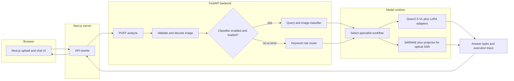
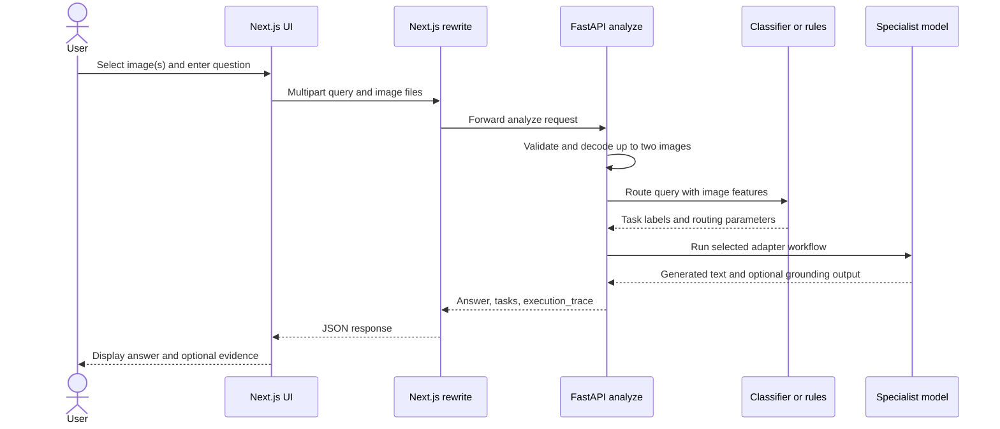
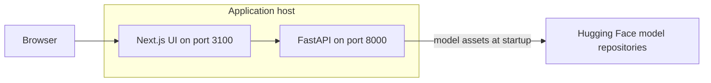

<p align="center">
  
  <br />
  <strong>SatQuery AI</strong><br />
  <em>Ask questions about satellite imagery in plain language.</em><br /><br />
  <a href="https://img.shields.io/badge/SIH-2026-1f6feb"></a>
  <a href="https://img.shields.io/badge/PS-SIH26167-315c7d"></a>
  <a href="https://img.shields.io/badge/theme-Space%20Technology-493ca6"></a>
  <a href="https://img.shields.io/badge/category-Software-317c6e"></a>
  <a href="https://img.shields.io/badge/stack-Next.js%20%7C%20FastAPI-20232a"></a>
  <a href="https://img.shields.io/badge/license-unspecified-lightgrey"></a>
  <a href="https://img.shields.io/badge/status-prototype-f0b429"></a>
  <br /><br />
  <a href="https://youtu.be/_3UY2hBNBjk">🎥 Demo</a> ·
  <a href="#-getting-started">🌐 Live: TODO</a> ·
  <a href="docs/SatQuery_Seal_Team6.pdf">📊 Deck</a> ·
  <a href="docs/ARCHITECTURE.md">📄 Architecture notes</a> ·
  <a href="https://github.com/dhwanijain-dev/anonymous_codebase_167">GitHub repo</a>
</p>

## ⚡ Evaluator Quick View

- **Problem:** The deck frames satellite-image analysis as difficult to access without GIS or model-selection expertise; the official PS text is not included.
- **Solution:** Upload one image or a pair, ask a natural-language question, and route it to a remote-sensing specialist workflow.
- **Impact sought:** Make imagery analysis easier for agriculture, disaster response, urban planning, and research; the deck reports no measured outcomes.
- **Fastest verified run:** The web interface only. The commands below were run on an isolated copy of `frontend/`; backend inference was not run.

```powershell
cd frontend
pnpm install --frozen-lockfile
pnpm build
pnpm start -- --port 3100
```

This serves the UI at `http://localhost:3100`. Image analysis also needs the model-backed API described under [Getting Started](#-getting-started).

| Deck heading | README location |
| --- | --- |
| Proposed Solution | [Solution and Innovation](#-solution-and-innovation), [Features](#-features) |
| Technical Approach | [Architecture](#-architecture), [Tech Stack](#-tech-stack), [AI and ML](#-ai-and-ml) |
| Feasibility and Viability | [Feasibility, Scalability, and Risks](#-feasibility-scalability-and-risks) |
| Impact and Benefits | [Impact](#-impact) |
| Research and References | [References](#-references-acknowledgements-and-licence) |

<details>
<summary>Contents</summary>

- [📌 Problem Statement](#-problem-statement)
- [💡 Solution and Innovation](#-solution-and-innovation)
- [✨ Features](#-features)
- [🏗️ Architecture](#-architecture)
- [🧰 Tech Stack](#-tech-stack)
- [🚀 Getting Started](#-getting-started)
- [🎮 Usage and Demo](#-usage-and-demo)
- [🧠 AI and ML](#-ai-and-ml)
- [📈 Feasibility, Scalability, and Risks](#-feasibility-scalability-and-risks)
- [🌍 Impact](#-impact)
- [🗺️ Roadmap](#-roadmap)
- [📁 Project Structure](#-project-structure)
- [👥 Team](#-team)
- [📚 References, Acknowledgements, and Licence](#-references-acknowledgements-and-licence)

</details>

## 📌 Problem Statement

The deck identifies the challenge as making satellite-imagery analysis accessible through natural-language questions and specialist remote-sensing models. It names agriculture, disaster response, urban planning, and research as target settings. The full official problem statement is not reproduced in the deck.

| Field | Deck value |
| --- | --- |
| SIH edition | 2026 |
| Problem statement ID | SIH26167 |
| Problem statement title (as labelled in the deck) | SatQuery AI |
| Theme | Space Technology |
| Category | Software |
| Team ID | 178961 |
| Team name | Seal Team 6_SUAS26 |
| PS-owning organisation | TODO(identify from the official SIH problem statement) |
| Official PS text / portal link | TODO(add the official SIH PS URL; the deck contains only a short framing) |

### Deck promise to code traceability

“Present in source” means the repository contains the described path; it does not mean an end-to-end backend run was verified.

| Deck promise or requirement | Status | Evidence and current boundary |
| --- | --- | --- |
| Single-image VQA and natural-language query | ✅ Present in source | [`frontend/app/page.tsx`](frontend/app/page.tsx) uploads query + image; [`backend/vlm.py`](backend/vlm.py) has a single-image workflow. Runtime unverified. |
| Captioning and text-guided grounding | ✅ Present in source | `GROUNDING_CAPTIONING` workflow returns parsed boxes and an evidence image when grounding is requested; output depends on generated text matching the parser. |
| Bi-temporal change and optical–SAR pair workflows | 🧩 Partial | The API accepts up to two images and has both workflow branches. It does not verify temporal ordering, CRS, resolution, or co-registration. |
| Specialist query routing | 🧩 Partial | A checked-in classifier checkpoint routes query + image features; deterministic keyword rules are the fallback. The deck's Groq/LLM supervisor is not called by the current route. |
| Visual evidence, confidence, and auditable summary on every answer | 🧩 Partial | The API includes task outputs and an execution trace; grounding can return boxes/evidence. No answer-confidence field is returned, and evidence is conditional rather than present for every task. |
| LLaMA, PostgreSQL, and VectorDB | 🗺️ Planned | Page 3 lists these in the proposed stack; Qwen2.5-VL and SARMAE are wired, but no LLaMA runtime or database implementation was found. |
| Tiled inference and GPU-optimised caching for large rasters | 🗺️ Planned | Deck page 4 proposes it; current request path reads the full upload into memory and converts the raster before inference. |
| Evaluation on public benchmarks / ISRO-SAC data | 🗺️ Planned | Named as a validation plan in the deck; no evaluation scripts, metric reports, or ISRO/SAC dataset are present. |

## 💡 Solution and Innovation

SatQuery combines a browser upload/chat interface with a FastAPI analysis endpoint. The API validates an image, chooses one or more specialist tasks, loads results from the model registry, and returns answer text, task metadata, and an execution trace.

1. The user uploads one image or a pair and writes a question.
2. The API decodes PNG/JPEG or TIFF/GeoTIFF input. For GeoTIFF, it makes an RGB-style PIL image from the first three bands (or grayscale for one band); geospatial transforms are not carried into the model request.
3. If enabled and loadable, the multi-label classifier selects specialist labels from text and image features. If it is disabled, missing, or errors, local keyword rules choose the route.
4. The workflow activates the matching Qwen2.5-VL adapter; optical–SAR also uses a SARMAE encoder and projector.
5. The API returns generated text, task outputs, timing, input metadata, and routing/model information. Grounding outputs can include parsed boxes and an image data URL.

The deck presents dynamic specialist selection, optical/SAR plus temporal reasoning, remote-sensing adaptation, and traceability as its differentiators. Those are design claims, not a measured comparison against other systems. The current route is a trained classifier with rule fallback; no external LLM supervisor request is made in the checked-in code.

## ✨ Features

| Feature | What it does | Status | Module |
| --- | --- | --- | --- |
| Image question answering | Sends one uploaded image and question to the single-image VQA adapter. | ✅ In source; runtime unverified | [`backend/vlm.py`](backend/vlm.py) |
| Captioning and grounding | Produces text; optionally parses coordinate-like boxes and returns an evidence image. | 🧩 In source; parser-dependent | [`backend/vlm.py`](backend/vlm.py) |
| Change analysis | Routes two images to the change-analysis adapter. | 🧩 In source; pair alignment unverified | [`backend/vlm.py`](backend/vlm.py), [`backend/main.py`](backend/main.py) |
| Optical–SAR analysis | Uses the SARMAE encoder/projector with the corresponding adapter. | 🧩 In source; modality validation unverified | [`backend/model_loader.py`](backend/model_loader.py) |
| Query/image routing | Multi-label classifier with a deterministic keyword fallback. | ✅ In source; accuracy not measured here | [`backend/clf_router.py`](backend/clf_router.py), [`backend/satquery_classifier.py`](backend/satquery_classifier.py) |
| Browser chat UI and execution trace | Uploads up to two accepted file types, posts multipart data, shows answers, can export a grounding result as JSON, and receives task/model/timing trace data. | UI build and HTTP page verified; backend trace unverified | [`frontend/app/page.tsx`](frontend/app/page.tsx), [`backend/main.py`](backend/main.py) |

## 🏗️ Architecture

The diagrams show the implementation in this repository. They do not include the deck's proposed database or external LLM supervisor.



| Component | Responsibility |
| --- | --- |
| Browser UI | Collects the natural-language query and up to two images; renders answer and optional grounding overlay. |
| Next.js rewrite | Proxies `/api/backend/*` to `SATQUERY_BACKEND_URL` (default `http://127.0.0.1:8000`). |
| FastAPI | Exposes health, model registry, lightweight classification, and image-analysis routes. |
| Classifier / rules | Selects task labels using the checked-in checkpoint, or local keyword rules on fallback. |
| Model runtime | Loads the shared Qwen2.5-VL base and task adapters; adds SARMAE/projector for optical–SAR. |
| Response | Returns answer, per-task output, request identifier, and execution trace. |

### Core request sequence



| Sequence step | Code responsibility |
| --- | --- |
| Multipart request | The page submits `query`, `modalities`, `image1`, and optional `image2`. |
| Validation | Format allowlist, bytes decoding, and image metadata are handled before routing. |
| Routing | Classifier inference or keyword fallback produces task labels and parameters. |
| Specialist call | `execute_workflow` dispatches VQA, grounding/captioning, change, or optical–SAR paths. |
| Response | The handler assembles task results and an execution trace for the UI. |

No database is present, so an ER diagram is not applicable. The chat history lives in browser component state and is not persisted by the backend.

### Local deployment path

The web and model API run as separate processes. The model loader fetches configured model assets from Hugging Face when they are not already available locally.



| Process or service | Responsibility |
| --- | --- |
| Next.js | Serves the UI and rewrites `/api/backend/*` requests to the API. |
| FastAPI | Loads the model runtime and handles analysis requests on port 8000. |
| Hugging Face | Hosts the configured base model, adapters, SARMAE encoder, and projector. |
## 🧰 Tech Stack

Versions are shown only where present in manifests or measured on the verification host. Backend dependencies are unpinned in `backend/requirements.txt`.

| Layer | Repository implementation | Version / source | Purpose |
| --- | --- | --- | --- |
| Web | Next.js, React, TypeScript | Next.js 16.3.4; React 19.2.8; TypeScript `^5` (lockfile resolves 5.9.3) | Upload/chat interface and API rewrite. |
| UI | Tailwind CSS, Base UI, Remix Icon | Lockfile versions | Styling and controls. |
| API | FastAPI, Uvicorn, Pydantic | Unpinned in requirements | HTTP endpoints and request validation. |
| Inference | PyTorch, Transformers, PEFT, Unsloth, bitsandbytes | Unpinned in requirements | Qwen2.5-VL base and adapter loading. |
| Specialist models | Qwen2.5-VL 3B 4-bit base + four LoRA adapters; SARMAE + projector for optical–SAR | Defaults in `backend/model_loader.py` | Task-specific VQA, grounding/captioning, change, and fusion paths. |
| Router | PyTorch multi-label classifier; MobileNetV3-Small image features; `all-MiniLM-L6-v2` text features | Classifier code and checkpoint in `backend/` | Selects task labels from query and image. |
| Image IO | Pillow, NumPy, Rasterio | Unpinned in requirements | Decode common images and GeoTIFF data. |
| Data | JSONL routing manifest and PyTorch checkpoints | Checked-in files | Router training inputs/artifacts; referenced image files are not included. |
| Database | None in current code | PostgreSQL/VectorDB appear only in deck | No persistence or vector search implementation. |

## 🚀 Getting Started

> [!WARNING]
> Only the frontend install, typecheck, build, production start, and HTTP page load were verified. The backend was not installed or started. It loads a 4-bit vision-language model, four adapters, and SARMAE assets during import, and the repository does not pin a tested Python/CUDA environment.

### Prerequisites

| Tool | Verified on this host | Repository constraint |
| --- | --- | --- |
| Node.js | v22.18.0 | No `.nvmrc` or `engines` field. |
| pnpm | 10.27.0 | `frontend/pnpm-lock.yaml` uses lockfile format 9. |
| Python | 3.12.10 present; source syntax parsed | No Python version pin or backend install verification. |
| NVIDIA/CUDA | Not verified | Deck lists CUDA; model loader requests 4-bit loading and places SARMAE on the model device. Confirm a compatible GPU/software stack before backend setup. |
| Hugging Face access | Not verified | A read token is needed if any configured model repository requires authentication; first startup may download large model files. |

**Clone (not executed because the repository was already present):** `git clone https://github.com/dhwanijain-dev/anonymous_codebase_167.git`
### Run the web interface (verified)

Run from the repository root. This exact sequence passed on an isolated copy of `frontend/`; it does not start the inference backend.

```powershell
cd frontend
pnpm install --frozen-lockfile
pnpm build
pnpm start -- --port 3100
```

Open `http://localhost:3100`. The tested production page returned HTTP 200 and contained the SatQuery welcome UI.

### Configure and run the backend (not executed)

`backend/requirements.txt` has no pinned versions. These commands are setup guidance from the repository layout, not a verified install path. Use a GPU environment compatible with Unsloth, bitsandbytes, and the model loader. `python main.py` loads models before Uvicorn begins listening on port 8000.

<details>
<summary>Windows PowerShell (not executed)</summary>

```powershell
cd backend
py -3.12 -m venv .venv
.\.venv\Scripts\Activate.ps1
python -m pip install --upgrade pip
python -m pip install -r requirements.txt
Copy-Item ..\.env.example ..\.env
# Edit ..\.env and set HF_TOKEN_BASE if the model repositories require a token.
python main.py
```

</details>

<details>
<summary>Linux / macOS shell (not executed)</summary>

```bash
cd backend
python3 -m venv .venv
source .venv/bin/activate
python -m pip install --upgrade pip
python -m pip install -r requirements.txt
cp ../.env.example ../.env
# Edit ../.env and set HF_TOKEN_BASE if the model repositories require a token.
python main.py
```

</details>

The backend listens on `http://127.0.0.1:8000`; FastAPI's default interactive API page is at `/docs` when the server starts successfully. For a non-default backend address, set `SATQUERY_BACKEND_URL` in the frontend process environment or in `frontend/.env.local` before starting Next.js.

### Environment variables

The defaults below are read from code. Secrets are blank/placeholders in [`.env.example`](.env.example); do not commit a filled `.env` file.

| Variable | Purpose | Required | Default / behavior |
| --- | --- | --- | --- |
| `SATQUERY_BACKEND_URL` | Next.js rewrite destination. | No | `http://127.0.0.1:8000` |
| `HF_TOKEN_BASE` | Hugging Face token used for the base model and as fallback for adapter tokens. | If repo access requires authentication | No default. |
| `HF_TOKEN` | Legacy fallback alias for `HF_TOKEN_BASE`. | No | Used if `HF_TOKEN_BASE` is unset. |
| `HF_TOKEN1`, `HF_TOKEN2`, `HF_TOKEN3`, `HF_TOKEN4` | Optional per-repository tokens for four adapters/SAR components. | Only if access differs | Each falls back to the base token; `HF_TOKEN1` can also seed the base token. |
| `BASE_MODEL` | Base VLM repository. | No | `unsloth/Qwen2.5-VL-3B-Instruct-bnb-4bit` |
| `HF_MODEL_REPO1`, `HF_MODEL_REPO2`, `HF_MODEL_REPO3`, `HF_MODEL_REPO4` | Adapter repositories for VQA, grounding, change, optical–SAR. | No | Defaults are in `backend/model_loader.py`. |
| `HF_HUB_ENABLE_HF_TRANSFER`, `HF_HUB_DISABLE_XET`, `HF_HUB_DOWNLOAD_TIMEOUT`, `HF_HUB_ETAG_TIMEOUT` | Hugging Face Hub download settings. | No | Loader removes the legacy transfer flag; defaults Xet off, download timeout 300 seconds, metadata timeout 60 seconds. |
| `CLASSIFIER_CHECKPOINT` | Router classifier checkpoint path. | No | `backend/satquery_clf.pt` |
| `CLF_THRESHOLD` | Classifier output threshold. | No | `0.5` |
| `SATQUERY_USE_CLF_ROUTER` | Enables classifier routing when checkpoint loads; otherwise uses keyword rules. | No | `true` |
| `MAX_NEW_TOKENS` | Generation token limit. | No | `256` |
| `LOG_LEVEL` | Backend logging level. | No | `INFO` |
| `USE_4BIT` | Read by `main.py`, but does not change loader's hard-coded `load_in_4bit=True`. | No | `true`; currently has no effect on model loading. |
| `GROQ_API_KEY`, `GROQ_URL` | Legacy supervisor settings. | No | Read in `backend/supervisor.py`, but current routing makes no Groq HTTP request. |
| `GROQ_MODEL` | Model label reported by `/health`. | No | `openai/gpt-oss-20b`; not used for an external request in current routing. |

### Verify the services

| Check | Expected result | Evidence status |
| --- | --- | --- |
| `http://localhost:3100` | SatQuery upload/chat UI; HTTP 200 | ✅ Executed in isolated frontend copy. |
| `http://127.0.0.1:8000/health` | JSON containing `"status": "ok"` and model/router details | ⏸ Not executed; backend model load was not attempted. |
| Submit an image query | Answer, task list, and execution trace in JSON | ⏸ Not executed end to end. |

No database migration or seed step exists in the repository. There are no test files or test script. Frontend checks that are available are:

```powershell
cd frontend
pnpm typecheck
pnpm build
pnpm lint
```

`typecheck` and `build` passed in the isolated copy. `lint` was executed and failed before linting source with an ESLint/plugin compatibility error; details are below. Python source syntax was separately parsed for 47 files, which is not a runtime test.

<details>
<summary>Troubleshooting and known verification failures</summary>

- **`pnpm lint`** — Executed. ESLint 10.10.0 crashed while loading `react/display-name`: `contextOrFilename.getFilename is not a function` (locked `eslint-plugin-react` 7.37.5). Proposed maintenance action: align ESLint and React plugin versions, then rerun lint; no dependency change was applied.
- **Backend import/startup** — Not executed. Importing `backend/main.py` imports `model_loader.py`, which loads the base VLM, adapters, and SARMAE assets immediately. No CUDA/model-access setup was verified.
- **Large GeoTIFFs** — Current API reads the full upload into memory; tiled inference and caching are not present.

</details>

## 🎮 Usage and Demo

Watch the [video demonstration linked in the deck](https://youtu.be/_3UY2hBNBjk). No screenshots from a running application are included in this repository; see the final handoff report for a capture list.

In the browser, choose one image or a pair, enter a question, and submit. The UI accepts `.tif`, `.tiff`, `.png`, `.jpg`, and `.jpeg`; it limits the selection to two files. Example prompts in the UI include object-location, building-count, and scene-description questions. The server validates the extension and decodes TIFF input, then routes to a specialist workflow.

### API routes

These routes are defined in `backend/main.py`; request execution was not verified.

| Method and path | Input | Response purpose |
| --- | --- | --- |
| `GET /health` | None | Status, configured base model, router type, checkpoint path, and device. |
| `GET /models` | None | Base model and specialist model registry. |
| `POST /classify` | Multipart `query`, `image_count`, optional `modalities` | Returns local rule-based classes/workflow/parameters; despite legacy naming, current implementation does not call Groq. |
| `POST /analyze` | Multipart `query`, required `image1`, optional `image2`, optional `modalities` | Runs routing and model workflow; returns answer, tasks, and trace. |

FastAPI's default Swagger page is expected at `/docs` after the model-backed server starts. The frontend calls analysis through `/api/backend/analyze`.

### Analysis request example (not executed)

```bash
# Not executed: backend/model access was not verified.
curl -X POST http://127.0.0.1:8000/analyze \
  -F 'query=Describe the visible scene' \
  -F 'image1=@path/to/image.tif'
```

The shape below is derived from the response construction in `backend/main.py`; angle-bracket values are placeholders, not captured model output.

```json
{
  "request_id": "<generated-id>",
  "answer": "<generated answer or null>",
  "tasks": [
    {
      "task": "<selected task label>",
      "result": { "answer": "<generated task answer>" },
      "model": { "<registry fields>": "<configured model metadata>" }
    }
  ],
  "execution_trace": {
    "selected_tasks": ["<task label>"],
    "workflow": ["<workflow label>"],
    "models": ["<router and specialist metadata>"],
    "inputs": ["<uploaded image metadata>"],
    "total_latency_seconds": "<measured at request time>"
  }
}
```

## 🧠 AI and ML

- **Router:** a checked-in multi-label PyTorch classifier combines frozen `all-MiniLM-L6-v2` query features, MobileNetV3-Small image features, and metadata features. Four labels map to VQA, grounding/captioning, change analysis, and optical–SAR tasks.
- **Specialists:** the default loader uses a Qwen2.5-VL 3B 4-bit base with four LoRA adapters. The optical–SAR path also loads a SARMAE encoder and a projector checkpoint from the configured Hugging Face repository.
- **Artifacts:** `backend/satquery_clf.pt` (1,876,106 bytes), `backend/satquery_clf_features.pt` (27,955,618 bytes), and `backend/router_manifest_combined.jsonl` (4,500 records). The manifest references 7,000 image entries (3,135 unique); none of those referenced image paths resolve inside this checkout.
- **Training:** a classifier training CLI exists in `backend/satquery_classifier.py`. Reproducing training needs the referenced image files and compatible dependencies; none of the manifest image paths resolve in this checkout, so training was not run. No VLM fine-tuning script or benchmark evaluation report is in this repository.
- **Metrics:** no measured accuracy, calibration, latency benchmark, or quality score is published here. Router probabilities are routing outputs, not a validated confidence score for the generated answer.
- **Data:** the deck names BigEarthNet, VRSBench, RSVQA, and CDVQA as data/benchmark sources. Their image data is not bundled in this repository; the references below preserve the deck's links.

## 📈 Feasibility, Scalability, and Risks

| Risk or design point | Deck mitigation / implementation evidence | Current assessment |
| --- | --- | --- |
| Scarce paired optical–SAR and bi-temporal data | Deck proposes BigEarthNet/CDVQA, augmentation, and self-supervised pretraining. | No paired data or VLM training run is included; manifest image references are unresolved in this checkout. |
| Domain gap for remote-sensing imagery | Deck proposes fine-tuning on remote-sensing benchmarks; model registry uses task-specific adapters. | Adapter existence is configured in source; benchmark scores are absent. |
| SAR speckle and modality differences | Deck proposes a dedicated SAR encoder and denoising. | SARMAE and projector are wired in the loader; no SAR denoising stage was found. |
| Ambiguous query routing | Deck proposes hybrid rule + LLM routing. | Code has classifier + keyword fallback; no external LLM route call or confidence calibration is implemented. |
| Large GeoTIFFs and compute limits | Deck proposes patch/tile inference and GPU caching. | Upload bytes are fully read and the image is resized for a workflow; tile streaming/caching is absent. |
| Co-registration and pair compatibility | Deck assumes co-registered pairs. | Current code does not validate CRS, timestamps, dimensions, or alignment before resizing/combining images. |
| Public operational use | Not specified in deck. | No API authentication, database, or request-size limit was found; the SAR loader uses `trust_remote_code=True`, so inspect and pin trusted model revisions before deployment. |
| Cost, schedule, and scale | No sourced figures in the deck or repository. | TODO(measure GPU memory, startup/download size, per-query latency/cost, and concurrent-load behavior). |

The model-backed service's feasibility on a clean Windows or Linux machine is **not established**: package versions, CUDA compatibility, model access, and backend installation were not executed. Treat the deck's scalability and impact statements as proposals until tested with measured workloads.

## 🌍 Impact

The deck identifies farmers and agriculture agencies, disaster-response teams, urban infrastructure planners, and research institutions as intended beneficiaries. It suggests faster crop/land-cover monitoring, rapid damage assessment, built-up growth tracking, and a unified research/evaluation interface.

These are potential benefits from the proposal, not measured outcomes. The deck provides no before/after timings, user study, benchmark result, deployment count, economic estimate, or environmental measurement. No national-initiative alignment is claimed because none is substantiated by this repository or deck.

## 🗺️ Roadmap

| Stage | Work item | Traceability |
| --- | --- | --- |
| Present in source (runtime unverified) | Web upload/chat flow, API routes, classifier + keyword fallback, four specialist workflow branches, execution trace. | [`frontend/app/page.tsx`](frontend/app/page.tsx), [`backend/main.py`](backend/main.py), [`backend/clf_router.py`](backend/clf_router.py), [`backend/vlm.py`](backend/vlm.py) |
| Partial | Pair compatibility validation, per-answer visual evidence, end-to-end confidence reporting. | Pair upload/analysis exists, but co-registration checks and answer-confidence output do not. |
| Next | Pin and document a tested Python/CUDA setup; add backend smoke tests and frontend lint compatibility fix; verify a clean end-to-end run. | Required before presenting a reproducible full prototype. |
| Next | Implement bounded GeoTIFF tiling/caching and pair metadata/alignment checks. | Addresses feasibility risks on deck page 4. |
| Next | Add calibrated answer confidence and evaluation on public remote-sensing benchmarks; publish methodology and measured results. | Addresses deck promises on pages 2–5 without overstating current evidence. |
| Next | Decide whether PostgreSQL/VectorDB are still needed; if so, add schema, persistence, and an API contract. | Deck page 3 lists them; no database code currently exists. |

## 📁 Project Structure

```text
.
├── README.md
├── .env.example
├── docs/
│   ├── ARCHITECTURE.md
│   ├── SatQuery_Seal_Team6.pdf
│   └── assets/
│       └── banner.svg
├── backend/
│   ├── main.py                       # FastAPI routes, CLI, response trace
│   ├── supervisor.py                 # Deterministic keyword routing
│   ├── clf_router.py                 # Classifier inference and fallback
│   ├── satquery_classifier.py        # Router training and inference
│   ├── model_loader.py               # VLM/adapters/SARMAE loading
│   ├── vlm.py                        # Specialist workflows
│   ├── image_validation.py           # Upload decoding/normalisation
│   ├── prepare_manifest.py           # Router manifest preparation
│   ├── unsloth_compiled_cache/      # Tracked generated helper modules
│   ├── router_manifest_combined.jsonl
│   ├── satquery_clf.pt               # Router checkpoint
│   ├── satquery_clf_features.pt      # Router feature cache
│   └── requirements.txt              # Unpinned Python dependencies
└── frontend/
    ├── app/                           # Next.js page and styles
    ├── components/                    # UI/theme components
    ├── package.json                   # Scripts and frontend dependencies
    └── pnpm-lock.yaml
```

## 👥 Team

| Name | Role | GitHub | LinkedIn |
| --- | --- | --- | --- |
| TODO(add member name) | TODO(add role) | TODO(add profile) | TODO(add profile) |

- **Team:** Seal Team 6_SUAS26 (Team ID 178961)
- **Mentor:** TODO(add mentor name)
- **Institute:** TODO(add institute name)

## 📚 References, Acknowledgements, and Licence

References are transcribed from the deck's final page; links below are the hyperlinks embedded in that page. Author, venue, and publication metadata should be checked before a formal bibliography is submitted.

1. [BigEarthNet.txt: A Large-Scale Multi-Sensor Image-Text Dataset and Benchmark for Earth Observation](https://arxiv.org/abs/2603.29630)
2. [RSVQA: Visual Question Answering for Remote Sensing Data](https://arxiv.org/abs/2003.07333)
3. [VRSBench: A Versatile Vision-Language Benchmark Dataset for Remote Sensing Image Understanding](https://arxiv.org/abs/2406.12384)
4. [ThinkGeo: Evaluating Tool-Augmented Agents for Remote Sensing Tasks](https://arxiv.org/abs/2505.23752)
5. [Deep Learning in Multimodal Remote Sensing Data Fusion: A Comprehensive Review](https://arxiv.org/abs/2205.01380)
6. [Change Detection Meets Visual Question Answering (CDVQA)](https://arxiv.org/abs/2112.06343)
7. [RSVG: Exploring Data and Models for Visual Grounding on Remote Sensing Data](https://arxiv.org/abs/2210.12634)
8. [Multi-Agent Geospatial Copilots for Remote Sensing Workflows (GeoLLM-Squad)](https://arxiv.org/abs/2501.16254)
9. [SAR Strikes Back: A New Hope for RSVQA](https://arxiv.org/abs/2501.08131)

**Acknowledgements:** Smart India Hackathon 2026, the Ministry of Education's Innovation Cell, and AICTE. TODO(confirm the PS-owning organisation from the official statement).

**Licence:** TODO(add a licence). No `LICENSE` file is present; do not assume the repository is open source under a particular licence.